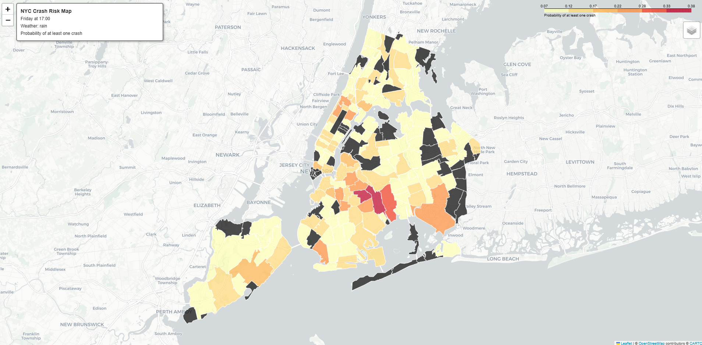

# NYC Crash Risk Predictor

Monte Carlo simulation project for estimating the probability of at least one motor vehicle crash in a selected New York City ZIP code during a selected one-hour time block.

This project is designed for undergraduate probability, statistics, and data science students. The code is intentionally practical and readable: data download, cleaning, feature engineering, simulation, validation, and visualization are split into small modules that can also be called from notebooks.

## Project Overview

The main question is:

> Given a ZIP code, day of week, hour of day, and weather scenario, what is the estimated probability of at least one motor vehicle crash during that hour?

The project uses NYC Open Data crash records to estimate historical crash rates by:

- ZIP code
- day of week
- hour of day

Then it uses a Monte Carlo simulation to model uncertainty around the crash rate.

## Why Monte Carlo?

A simple historical average can tell us the observed crash rate, but it hides uncertainty. Some ZIP/day/hour combinations may have only a small number of observed crashes. Monte Carlo simulation lets us repeatedly sample plausible crash rates and crash outcomes, then summarize the probability of at least one crash.

This makes the result easier to explain in probability language:

- estimate a crash arrival rate
- sample possible values of that rate
- simulate possible crash counts
- calculate the share of trials with one or more crashes

## Dataset

Source: NYC Open Data Motor Vehicle Collisions - Crashes

Endpoint:

```text
https://data.cityofnewyork.us/resource/h9gi-nx95.csv
```

The project uses these fields:

- `crash_date`
- `crash_time`
- `borough`
- `zip_code`
- `latitude`
- `longitude`

By default, `main.py` downloads 50,000 rows so the project runs quickly on a normal laptop.

## Interactive Map Data Sources

The interactive crash probability map uses the following data sources:

| Source | URL | Description |
|--------|-----|-------------|
| **NYC Crash Data** | https://data.cityofnewyork.us/resource/h9gi-nx95.csv | NYC Open Data Motor Vehicle Collisions - Crashes dataset |
| **NYC ZIP Boundaries** | https://raw.githubusercontent.com/nycehs/NYC_geography/master/MODZCTA_2010_WGS1984.geo.json | ZIP Code Tabulation Areas (MODZCTA) GeoJSON from NYC Geography repository |

The GeoJSON file is sourced from the [nycehs/NYC_geography](https://github.com/nycehs/NYC_geography) GitHub repository, which contains NYC geographic boundaries originally published by the NYC Department of City Planning.

## How The Model Works

For each ZIP/day/hour bucket, the project counts crashes and estimates exposure.

Example:

If the dataset covers 20 Fridays, then ZIP 10001 on Friday at 5 PM has 20 observed one-hour periods of exposure.

The estimated crash rate is:

```text
estimated_lambda = crash_count / observed_hours
```

The simulation uses a Gamma-Poisson model:

```text
alpha_posterior = alpha_prior + crash_count
beta_posterior = beta_prior + observed_hours
```

For each Monte Carlo trial:

1. Sample `lambda` from the Gamma posterior.
2. Adjust `lambda` with a weather multiplier.
3. Sample a crash count from a Poisson distribution.
4. Record whether the simulated count is at least one.

Weather multipliers in the starter model:

| Weather | Multiplier |
|---|---:|
| clear | 1.00 |
| rain | 1.20 |
| snow | 1.35 |
| fog | 1.15 |
| high_wind | 1.10 |

These multipliers are simplified assumptions for teaching. A stronger version of the project would estimate them from real weather data.

## How To Run

Create and activate a virtual environment if desired, then install dependencies:

```bash
pip install -r requirements.txt
```

Run the end-to-end demo:

```bash
python main.py
```

The demo will:

- download crash data to `data/raw/nyc_crashes_raw.csv`
- clean it into `data/processed/nyc_crashes_clean.csv`
- build `data/processed/crash_rate_table.csv`
- run a Monte Carlo estimate
- save a histogram to `outputs/figures/simulated_crash_counts.png`
- save a convergence plot to `outputs/figures/convergence_plot.png`
- save a daily-count **empirical vs Poisson** figure to `outputs/figures/empirical_vs_poisson_daily_counts.png`
- save an **interactive crash probability map** to `outputs/maps/crash_map_<day>_<hour>.html`

### Quick Start: Generate the Interactive Map

1. Open terminal in the `nyc-crash-risk-predictor` folder

2. Install dependencies (if not already done):
   ```
   pip install -r requirements.txt
   ```

3. Run the program:
   ```
   python main.py
   ```

4. Open the map file in your browser:
   - File is at: `outputs/maps/crash_map_friday_17.html`
   - Or just double-click it in File Explorer
   - If the map cannot be seen, try pressing show in browser option 

That's it! The map shows NYC ZIP codes colored by crash probability.

Attached below is the image if you aren't able to compile it yourself



## Example Output

The exact numbers depend on the downloaded sample, but output will look like:

```text
Monte Carlo crash risk estimate
--------------------------------
ZIP code: 10001
Day/hour: Friday at 17:00
Weather condition: rain
Observed crashes in bucket: 12
Observed hours: 20
Estimated lambda: 0.6000
Probability of at least one crash: 51.20%
Mean simulated crashes: 0.720
5th to 95th percentile simulated crashes: 0 to 2
```

If ZIP 10001 is not present in the downloaded sample, the demo automatically selects the first valid ZIP/day/hour row from the crash rate table.

## Project Structure

```text
nyc-crash-risk-predictor/
├── data/
│   ├── raw/
│   └── processed/
├── notebooks/
│   ├── 01_data_cleaning.ipynb
│   ├── 02_feature_engineering.ipynb
│   ├── 03_monte_carlo_simulation.ipynb
│   ├── 04_validation.ipynb
│   └── 05_visualization.ipynb
├── src/
│   ├── __init__.py
│   ├── download_data.py
│   ├── clean_crashes.py
│   ├── feature_engineering.py
│   ├── monte_carlo.py
│   ├── validation.py
│   └── visualization.py
├── outputs/
│   ├── figures/
│   └── maps/
├── requirements.txt
├── README.md
└── main.py
```

## Notebooks

The notebooks follow the proposed instructional series:

1. `01_data_cleaning.ipynb` downloads and cleans the crash records.
2. `02_feature_engineering.ipynb` builds the ZIP/day/hour rate table.
3. `03_monte_carlo_simulation.ipynb` runs the Gamma-Poisson simulation.
4. `04_validation.ipynb` checks convergence, Brier score, and the empirical daily-count vs Poisson plot.
5. `05_visualization.ipynb` creates plots and a simple Folium map.

The notebooks call functions from `src/` instead of repeating large blocks of code.

## Video Breakdown

### 1. Problem and Why Monte Carlo

Introduce the real-world question, explain why crashes can be treated as event arrivals, and show why a probability estimate is more useful than a single yes/no prediction.

### 2. Data Cleaning and Feature Engineering

Walk through the raw NYC Open Data fields, parse dates and times, extract hour and day of week, and explain the exposure term `observed_hours`.

### 3. Building the Monte Carlo Simulation

Explain the Poisson assumption, the Gamma posterior for uncertainty in `lambda`, and how the simulation estimates `P(at least one crash)`.

### 4. Validation and Interpreting Results

Use convergence testing to show how estimates stabilize as trial counts increase. Introduce Brier score as a simple way to evaluate probability predictions.

### 5. Visualization, Use Cases, and Limitations

Show the histogram, convergence plot, and Folium map. Discuss how a city agency, student researcher, or analyst might use the output responsibly.

## Limitations

- This estimates probability, not certainty.
- Correlation does not imply causation.
- Weather multipliers are simplified unless estimated from real weather data.
- Some crashes may be missing or underreported.
- ZIP-level aggregation loses street-level detail.
- Traffic volume is not included.
- A Poisson model assumes crashes are independent within each bucket, which may not always hold.
- Downloaded samples may vary depending on the `limit` and ordering.

## Portfolio Framing

This project is a strong GitHub or resume piece because it combines:

- public data ingestion
- reproducible data cleaning
- feature engineering with exposure
- probability modeling
- Monte Carlo simulation
- validation
- data visualization
- clear communication for non-specialists

Suggested resume bullet:

> Built a Python Monte Carlo simulation using NYC Open Data to estimate ZIP-level hourly crash probabilities with a Gamma-Poisson model, validation checks, and visual outputs.

