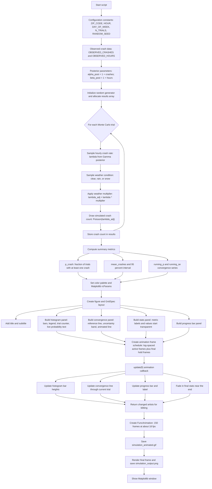

# Simulation Animated Flow

This diagram summarizes how `simulation_animated.py` runs the Monte Carlo crash-risk simulation, builds the animated visualization, and saves the final outputs.

## Notes

The script runs top-to-bottom: it performs the full Monte Carlo simulation before any animation frames are rendered. The animation then replays progressively larger prefixes of the already-computed `results` array.

`update(fi)` is the central animation callback. It reads the scheduled trial count for frame `fi`, refreshes the histogram, convergence line, progress bar, live probability label, and fades in the final stats during the hold frames.
